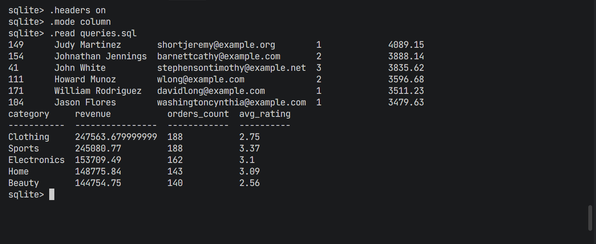

DILIGENT ASSESMENT

This project implements the complete workflow required for the Diligent hiring assessment using an AI-assisted SDLC approach.
It includes generating synthetic e-commerce datasets, ingesting them into a SQLite database, and performing SQL joins to produce meaningful analytical outputs.

1️⃣ generate_data.py
Creates five synthetic e-commerce datasets using Faker and pandas:

users.csv

products.csv

orders.csv

order_items.csv

reviews.csv

Generates realistic relationships:

Each order is linked to a user

Each order item links to a product

Reviews map to both products and users

Designed to be reproducible and fast.

2️⃣ ingest_to_sqlite.py
Reads all five CSV files.

Creates a SQLite database: ecom.db

Creates tables:

users, products, orders, order_items, reviews

Inserts the CSV data into each table.

Adds indexes to speed up multi-table joins:

orders.user_id

order_items.order_id

order_items.product_id

reviews.product_id

3️⃣ queries.sql
Contains two SQL queries demonstrating multi-table joins:

✔ Top 10 Customers by Completed Order Spend
Joins
users → orders
and aggregates:

number of orders

total spending

✔ Category-wise Revenue & Average Rating
Joins
products → order_items → reviews
to compute:

total revenue

total orders

average product rating

🚀 How to Run the Project
1. Install dependencies
pip install pandas faker

3. Generate synthetic data
python generate_data.py

4. Create SQLite database
python ingest_to_sqlite.py

5. Run SQL queries
Method A — CMD / Linux / macOS:
sqlite3 ecom.db < queries.sql

Method B — PowerShell:
Get-Content queries.sql | sqlite3 ecom.db

Method C — Interactive:
sqlite3 ecom.db
sqlite> .headers on
sqlite> .mode column
sqlite> .read queries.sql

## Output Preview

Here is the SQL join result:

